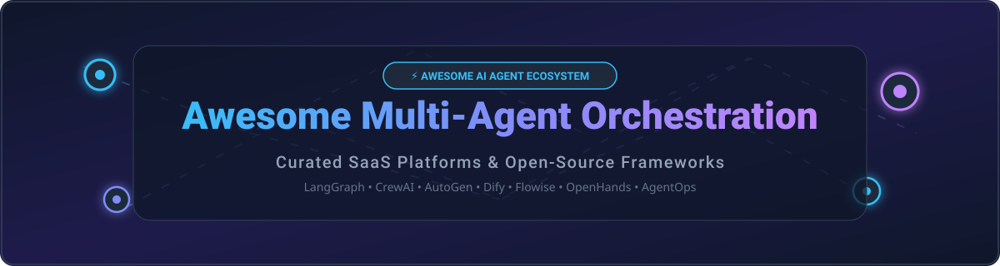

# 🤖 Awesome Multi-Agent Orchestration 🚀

  

  
  
  
  
  
  

---

## 💡 Overview & Top Multi-Agent Orchestration Ecosystem

**Curated List of SaaS Products & Open-Source GitHub Projects**  
*Focused on Multi-Agent Frameworks, Agent Orchestration, Stateful Workflows, Role-Based Crews, Visual Agent Builders & Autonomous Agent Systems.*

> [!NOTE]
> **Last updated: September 2026**

This repository tracks notable **SaaS platforms** and **open-source frameworks** for **Multi-Agent Orchestration**. These systems enable software developers, AI engineers, and enterprise teams to design, coordinate, evaluate, and deploy autonomous LLM agents collaborating on complex workflows—using role-based crews, stateful graphs, conversational patterns, or visual drag-and-drop builders.

---

## 📑 Table of Contents
- [🏢 SaaS/Hosted Platforms](#-saashosted-platforms)
- [🔓 Open-Source GitHub Projects](#-open-source-github-projects)
- [🛠️ How to Contribute](#️-how-to-contribute)
- [🤝 Support & Sponsorship](#-support--sponsorship)
- [📈 Star History](#-star-history)
- [⚠️ Disclaimer](#%EF%B8%8F-disclaimer)

---

## 🏢 SaaS/Hosted Platforms

> 📊 **Market Size & Structure**: The global AI Agent & Multi-Agent Orchestration market is estimated at **$5.2 Billion in 2026** (projected to reach **$38+ Billion by 2030** with a ~64% CAGR). The market structure is **moderately fragmented**—hyperscalers (Microsoft) dominate enterprise suite integration, while specialized pure-play platforms (LangChain/LangGraph Cloud, CrewAI Enterprise, Dify Cloud) lead in developer adoption and graph/crew orchestration.

| SaaS Platform 🌐 | Enterprise Valuation / Funding 💰 | Starting Pricing Tier 💳 | Free Plan / Trial Limits 🆓 | Core Features & Description 📝 |
| :--- | :--- | :--- | :--- | :--- |
| **[Microsoft AutoGen Studio / Azure AI](https://microsoft.github.io/autogen/)** | **~$3.68 Trillion** (Market Cap) | **$0.03 / 1k tokens** (Pay-as-you-go via Azure AI) | **$200 Free Credits** (30-day Azure trial) | Managed enterprise environment for building multi-agent conversational patterns & tool-using agents. |
| **[LangGraph Cloud / LangSmith](https://www.langchain.com/langgraph)** | **$1.25 Billion** (Valuation) | **$39 / user / month** (Plus Plan) | **5,000 Traces / month** (Developer Plan forever free) | Hosted stateful multi-agent cloud, checkpointing runtime, long-running workflow observability & evaluation. |
| **[Dify Cloud](https://dify.ai/)** | **$180 Million** (Valuation) | **$59 / month** (Professional Plan) | **200 Message Credits** (One-time trial in Sandbox) | Visual canvas & backend workflow platform for multi-agent RAG pipelines, prompt engineering & agent hosting. |
| **[CrewAI Enterprise](https://www.crewai.com/)** | **~$100 Million+** ($18M+ Funding) | **$25 / month** (Individual Pro) | **7-Day Free Trial** (Full workspace sandbox testing) | Enterprise platform for deploying, monitoring & governing role-based autonomous agent crews with RBAC. |
| **[Lindy.ai](https://www.lindy.ai/)** | **~$50 Million** ($49.9M Funding) | **$29.99 / month** (Plus Plan) | **7-Day Free Trial** (~400 credits testing) | No-code AI agent builder for automated enterprise tasks, email handlers, meeting assistants & workflow triggers. |
| **[AgentOps](https://www.agentops.ai/)** | **~$15 Million** ($2.6M Funding) | **$40 / month** (Pro Plan) | **5,000 Events / month** (Developer Plan forever free) | Observability, session replays, LLM cost tracking, and security benchmarking specifically built for multi-agent systems. |
| **[Flowise Cloud](https://flowiseai.com/)** | *Acquired by Workday (2025)* | **$35 / month** (Starter Plan) | **2 Flows / 100 Predictions** (Cloud sunset November 2026) | Visual drag-and-drop builder for agentic workflows and LangChain nodes. |

---

## 🔓 Open-Source GitHub Projects

> 🌟 **Open-Source Ecosystem**: Multi-agent orchestration relies heavily on open source. Below are the leading open-source repositories ranked by community GitHub_Stars.

| Open-Source Project 🚀 | Stars ⭐️ | Description & Key Strengths 📌 |
| :--- | :--- | :--- |
| **[langchain-ai/langchain](https://github.com/langchain-ai/langchain)** |  | Foundational framework powering tools, memory, retrieval, and base agent abstractions across the AI ecosystem. |
| **[langflow-ai/langflow](https://github.com/langflow-ai/langflow)** |  | Dynamic multi-agent visual UI builder for prototyping complex AI components and multi-agent graphs. |
| **[langgenius/dify](https://github.com/langgenius/dify)** |  | All-in-one open-source LLM app development platform with visual multi-agent workflow orchestration and self-hosting. |
| **[All-Hands-AI/OpenHands](https://github.com/All-Hands-AI/OpenHands)** |  | Autonomous AI software development agent capable of writing, running, and debugging code in sandbox environments. |
| **[crewAIInc/crewAI](https://github.com/crewAIInc/crewAI)** |  | Lean framework for engineering role-playing autonomous AI crews. Assign specific goals, backstories, and collaborative task pipelines. |
| **[FlowiseAI/Flowise](https://github.com/FlowiseAI/Flowise)** |  | Open-source drag & drop visual builder for customized LLM agents and multi-agent chains. |
| **[microsoft/autogen](https://github.com/microsoft/autogen)** |  | Multi-agent conversation framework enabling agent-to-agent dialogue, group chats, code execution, and complex problem-solving. |
| **[run-llama/llama_index](https://github.com/run-llama/llama_index)** |  | Data framework for LLMs providing multi-agent data retrieval, agentic RAG, and structured knowledge connections. |
| **[langchain-ai/langgraph](https://github.com/langchain-ai/langgraph)** |  | Low-level orchestration framework for cyclic, stateful, multi-actor LLM applications with human-in-the-loop controls. |
| **[pydantic/pydantic-ai](https://github.com/pydantic/pydantic-ai)** |  | Type-safe production agent framework built on top of Pydantic for clean structured validation and control flow. |
| **[TransformerOptimus/SuperAGI](https://github.com/TransformerOptimus/SuperAGI)** |  | Developer-first autonomous AI agent infrastructure for running, managing, and monitoring concurrent autonomous agents. |

---

### 🧩 Core Framework Selection Guide

- **Production Stateful Orchestration**: Use **LangGraph** or **Pydantic-AI** for strict control flow, persistence, state recovery, and granular state-machine nodes.
- **Role-Based Agent Teams**: Use **CrewAI** for defining human-like roles, delegating tasks, and running collaborative team workflows.
- **Conversational Multi-Agent Workflows**: Use **AutoGen (AG2)** for inter-agent multi-party dialogue, code execution feedback loops, and debate networks.
- **Visual & Low-Code Deployment**: Use **Dify**, **Langflow**, or **Flowise** for team-wide visual canvas design, prompt tweaking, and instant REST API publishing.
- **Autonomous Software Engineering**: Use **OpenHands** for sandboxed code creation, bash terminal usage, and multi-step issue solving.

---

## 🛠️ How to Contribute

Contributions are welcome! Please follow these simple guidelines:

1. Fork this repository.
2. Update `README.md` with factual project details, links, pricing, or star metrics.
3. Keep entries organized within the respective tables.
4. Open a Pull Request detailing your additions or updates.

Check out our master list at [Awesome-Awesome-Awesome](https://github.com/ishandutta2007/Awesome-Awesome-Awesome) for more curated tech repositories.

---

## 🤝 Support & Sponsorship

If you find this repository helpful for your AI research or production agent stack, please consider supporting the project! 💖

- 🌟 **Star this repo** to help others discover multi-agent tools!
- 🍴 **Fork it** to customize your own resource list!
- 📢 **Share it** on Twitter / X, LinkedIn, or developer forums!
- ☕ **Sponsor the Maintainer**: Support continuous updates and curation via [GitHub Sponsors](https://github.com/sponsors/ishandutta2007).

---

## 📈 Star History

---

## ⚠️ Disclaimer

- This is a **community-curated** repository provided for educational and informational purposes.
- Multi-agent systems execute code, interact with APIs, and modify file structures autonomously. Always configure safety boundaries, rate limits, sandbox containers, and human-in-the-loop approvals before running agentic workflows in production.
